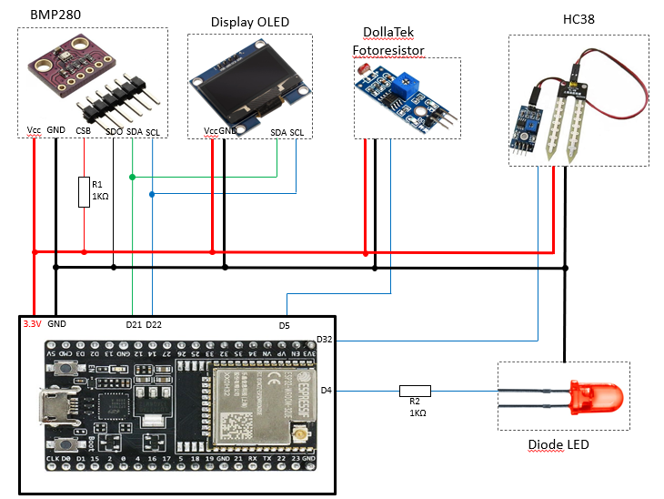

# ESP32 IoT Application

# 📟 EmbeddedProject
Smart Plant Monitor is an IoT project based on ESP32 chip. In this demonstration, application monitor plant life status and generate an alarm where specif conditions are met. ESP32 acquires ambient teperature, air humidity and light intensity radiation data, process them and provide information via bluetooth and using OLED display.

## 🚀 Features
- ✅ Read air humidity sensor using adc peripheral.
- ✅ Read ambient temperature using I2C protocol.
- ✅ Detect light intensity using digital peripheral.
- ✅ Turn On/Off diode Led based on algorithm and using digital peripheral.
- ✅ Show data on OLED display by I2C protocol.
- ✅ Provide data via Bluetooth.

## 🚀 Code Features
- ✅ Abstration layer to manage analogic peripheral
- ✅ abstraction layer for BLE protocol
- ✅ Abstration layer to manage digital peripheral
- ✅ Abstration layer for scheduler

## 🔧 Requirements
- Microcontroller: ESP32-WROOM-32
- Toolchain: VsCode + Extensions PlatformIO IDE
- Hardware:
  - 1x OLED I2C Display 128x64
  - 1x Sensor BMP280
  - 1x Hygrometer sensor HC38 module
  - 1x Light intensity sensor
  - 1x Diode led
  - 2x Resistor 1KΩ
  - Main Board: ESP32 NodeMCU
- Programming Interface: USB-UART

## 🛠️ Technologies
- Languages: C, C++
- Framework: Arduino
- Libraries: adafruit/Adafruit BMP280, adafruit/Adafruit SSD1306

## 🏗️ Hardware Setup
ESP32 NodeMCU communicate with several peripherals as described in the following table and scheme:

| ESP32 NodeMCU pin | OLED I2C Display pin |
|:-----------:|:------------:|
| 3.3V      | Vcc |
| GND    | GND |
| D22    | SCL |
| D21    | SDA |

| ESP32 NodeMCU pin | BMP280 pin |
|:-----------:|:------------:|
| 3.3V      | Vcc |
| GND    | GND |
| D22    | SCL |
| D21    | SDA |
| GND    | SDO |
| 3.3V    | CSB |

CSB pin requires pull-up resistor.

| ESP32 NodeMCU pin | HC38 module pin |
|:-----------:|:------------:|
| 3.3V      | Vcc |
| GND    | GND |
| D32    | A0 |
| NC    | D0 |

| ESP32 NodeMCU pin | Light Sns pin |
|:-----------:|:------------:|
| 3.3V      | Vcc |
| GND    | GND |
| D5    | D0 |

| ESP32 NodeMCU pin | Diode LED pin |
|:-----------:|:------------:|
| D4      | A |
| GND    | K |

Anode pin requires series resistor.

The scheme resume tables:


## 🏗️ Software Toolchain Setup
- Install VS-Code
- Install Extensions: PlatformIO IDE
- Push "PlatformIO" icon from primary side bar and click on "Pick a folder". You can open existing PlatformIO-based project (folder that contain platformio.ini file)

## 📦 Github Setup
Clone the repository:
```bash
git clone https://github.com/MpDev89/ESP32_IoT.git
cd project-name
```
## 🗒️ Results
Data is monitored using Serial Monitor feature where in task1 plant is monitored using data captured from sensors meanwhile in task2 data is sent over bluetooth low energy:


Nordic make available on the store an Android Application called nRF Connect to monitor data transmitted via Bluetooth.
Follow the procedure:
- Download Android Application and open
- Discover device "SmartPlantMonitor" and tap on it
- Waiting the pairing procedure 
- Data is shown through unknow services that contains three characteristics related to temperature, air humidity and light intensity. 


## 🗒️ Licensing
This project includes code licensed under the Apache License 2.0.
See the LICENSE file for details.

## 🌐 Contatti
[](mailto:mp@tech-in-mind.it)  
[](https://www.linkedin.com/in/marconatale-parise-48a07b94)  
[](https://github.com/MpDev89)